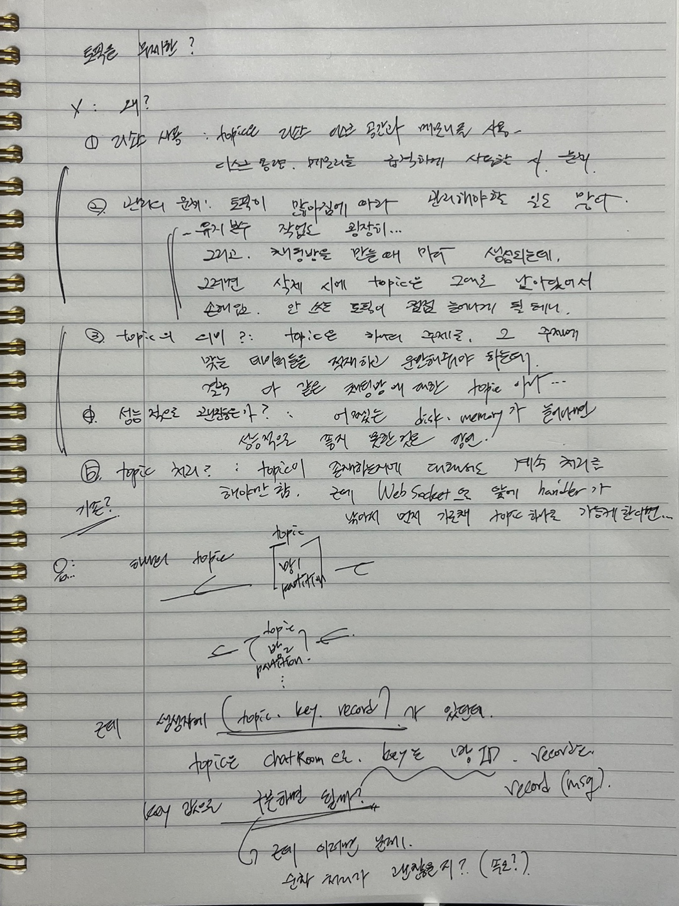

# Kafka

프로젝트에 Kafka를 넣을 일이 있어 넣게 됐고, 간단히 구현도 마쳐 놓은 상태인데 이슈라기보단 조언과 리뷰를 통해 잠시 아래와 같이 생각 중이다.

현재 프로젝트는 채팅방을 생성할 때마다 Topic을 생성(발행)하고 해당 채팅방에 들어온 유저는 그 방의 Topic을 구독하여 해당 방의 채팅 메시지(record) 를 받을 수 있게 됐다.

하지만 문제점이라기 보단 주의할 점이라고 해야할지, 한 가지가 있는데 **그것은 topic이 그대로 남아있다**는 것이다.

방을 삭제하게 되면 본래 topic도 같이 삭제를 처리하려 했으나, **어차피 삭제를 안 해도 된다**는 것이었다.

**왜냐하면 방을 삭제하게 된다면 두번 다시 해당 채팅방으로 들어올 수도 없고 그 채팅방으로 채팅을 보낼 수도 없기 때문이다.**

따라서 관리를 굳이 할 필요가 없었다는 점이지만 이는 걸림돌이 되었다.

이유는 아래의 사진과 같다. 글을 다시 옮겨서 적자면...

### Topic을 무제한으로 늘릴 수 있나? 있다면?

좋지 못한 패턴이다. 왜냐하면 나의 생각은 이렇다. 물론 구글링을 통해 지식을 캐온 것도 없지 않아 있다.
1. 리소스의 사용 : Topic은 Disk 공간과 Memory를 사용하는데, 용량, Memory를 급격하게 사용할 시 문제가 된다.
2. 관리의 문제 : Topic이 많아짐에 따라 관리해야할 일도 많아진다. 그리고 유지보수 작업도 굉장히 늘어나게 될 것이다. 
채팅방을 생성 시에 Topic을 발행하게 되는데, 현재는 삭제 시에 topic은 그대로 남겨져 있는 상태가 된다. 안 쓰이는 topic들이 점점 늘어나게 된다면 그것도 관리의 문제가 될 뿐더러 리소스의 사용 문제점도 생길 우려가 있을 것이다.
3. Topic의 의미? : 본래 Topic은 하나의 주제로, 그 주제에 맞는 record들을 적재하고 운반해줘야 하는데 결국 다 같은 ChatRoom의 Topic이다. 게다가 ChatRoomId(PK)로 구분하고 있으니 다 같은 맥락이다.
4. 성능적으로 괜찮을까 ? : 어쨌든 Disk, Memory가 늘어나면 성능적으로 좋지 못할 것이다.
5. Topic 처리 ? : Topic이 존재하는지에 대해서도 처리를 해줘야만 한다. 아마 null처리를 해줘야 하지 싶은데, 이 부분은 WebSocket에서 진작에 Handler로 처리하면 되지 않을까 싶다.

(~~글 안 쓴 지 오래돼서 악필~~)

Topic을 한 개로 처리하고 생성자 중에 (topic, key, record)가 있던 것을 봤는데, 그것을 활용해서 구현해보면 되지 않을까? 라는 생각이다.

만약 그렇게 된다면 하나의 토픽에 여러 채팅방의 record들이 동시에 다발적으로 들어올 것이고, 물론 동기적으로 실행되기 때문에 순서는 보장이 될 테지만
처리 속도에 관해서는 글쎄.. 감이 오지는 않는다. 그리고 하나의 topic이기에 서로 각기 다른 key(roomId) 값으로 필터링을 거치는 작업을 해야만 그 방의 채팅이 그 방에서만 보이게 할 거 같은데

이 부분에 관해서는 자세히 생각을 더 해볼 필요가 있어 보인다.

그리고 Topic에 관해서 Topic과 Partition의 적당한 수를 찾아보고, 토픽의 수에 따라 처리속도는 어떠한지 테스트해보는 것도 좋을 거 같다.
